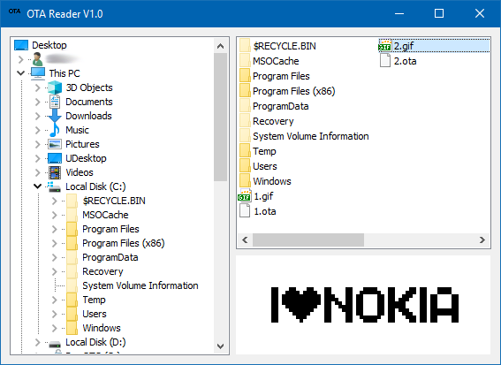

# Gif2OTA
A very old untility to convert GIF images to Nokia OTA  Smart Message Images

## Encoding An Ota Bitmap

An OTA bitmap is used as part of the following Smart Messaging formats: Operator logo, CLI icon, 
Picture Message, and Downloadable Profile. In today's Nokia phones the maximum size of the 
operator logo and the CLI icon is 72 x 14 pixels, while the maximum size of the picture message 
and the screen saver is 72 x 28 pixels.

An OTA bitmap consists of a bitmap header and bitmap data. The size of the bitmap is specified in 
the header. Other information is defined there as well, but it handles issues that are not supported
in today's Nokia phones. These values are similar in all OTA bitmap headers.

A typical OTA bitmap (72 x 14 pixels) header is: 00480E01

<pre>
00 Infofield
48 Width of the bitmap is 72 pixels
0E Height of the bitmap is 14 pixels
00 Number of colors or grey shades (only one color) 
</pre>

The image data is located after the header information and is encoded as follows. Each semi-octet in the
OTA bitmap presents 4 pixels in the original bitmap. Because one row takes 18 semi-octets, the whole 
72 x 14 (operator logo and CLI icon) bitmap takes 18 x 14 = 252 semi-octets = 126 octets. With picture
message and screen saver, the entire 72 x 28 size bitmap takes 18 x 28 = 504 semi-octets = 252 octets.

For example, if the first four pixels of the image are 1010 (1 - black, 0 - white), the first semi-octet
of the OTA bitmap data is hex A.

Here is an example of a simple OTA bitmap (72 x 14 pixels). In the picture, there are two black lines 
and several black dots:

<pre>
FFFFFFFFFFFFFFFFFF <- First line black
000000000000000000 <- Second line white
FFFFFFFFFFFFFFFFFF 
000000000000000000
10F000000000000000 <- Fourth pixel of this line is black and 9-12 pixels are also black
000000000000000000
000000000000000000
000000000000000000
000000000000000000
000000000000000000
000000000000000000
000000000000000000
000000000000000000
000000000000000001 <- Last pixel of this row/bitmap is black
</pre>

For more information, please refer to the Smart Messaging Specification 3.0.0.